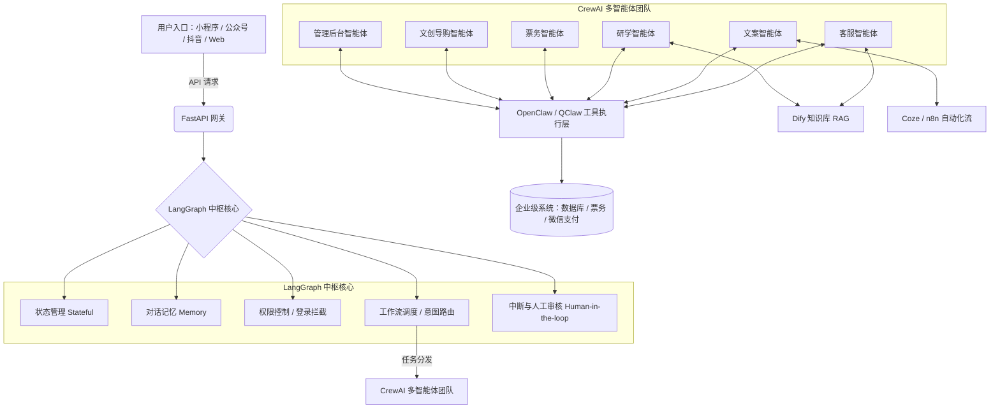

# 门神文化景区・LangGraph 多智能体运营中枢方案

## 一、 项目背景与目标
随着文旅行业的数字化转型深化，“门神文化景区”面临着线上线下服务触点分散、运营成本高昂、文化传播深度不足等挑战。传统的客服与业务系统（票务、电商、研学）相互割裂，导致游客体验缺乏连贯性，且景区内部的内容生产与运营管理效率遭遇瓶颈。

**核心目标：**
本项目旨在基于 **LangGraph + CrewAI** 等前沿 AI 技术，构建一个文旅行业全链路多智能体系统——**“门神文化智能运营中枢”**。通过打造统一的 AI 大脑，串联微信小程序、公众号、抖音、Web端等全域入口，实现智能客服、内容自动化生产、研学深度接待、票务与商户联盟运营、文创电商导购及景区导览的**一体化、无人化、智能化服务闭环**。

---

## 二、 业务需求与痛点分析

### 1. 游客端（To C）痛点
- **信息获取碎片化：** 了解门神文化、查询开放时间、咨询门票价格、预订研学路线需要跳转不同页面甚至不同平台，体验割裂。
- **互动性与沉浸感弱：** 传统图文介绍枯燥，游客对门神文化的历史渊源缺乏深度体验，亟需能随时解答文化知识的专属导游。
- **服务响应滞后：** 节假日高峰期，人工客服无法及时响应路线指引（如草莓园、咖啡馆怎么走）及售后问题。

### 2. 运营端（To B/内部）痛点
- **内容生产效率低：** 抖音短视频文案、公众号推文、门神文化讲解脚本及周边产品的美工设计耗费大量人力，产出速度跟不上营销节奏。
- **业务协同断层：** 票务系统、电商系统、商户联盟（一票多用规则）独立运行，跨系统数据流转难，缺乏智能化的统一调度和自动化处理。
- **管理决策缺乏实时性：** 访客数据、订单统计、票务异常往往依赖人工整理，缺乏自动化、实时的数据看板和异常预警机制。

---

## 三、 总体架构设计

本项目采用分层架构设计，确保系统的高内聚、低耦合，兼顾灵活性与可扩展性。

### 1. 业务架构
- **用户触点层：** 微信小程序（核心业务承载）、微信公众号（服务推送）、抖音（营销引流）、Web端/管理后台。
- **智能中枢层：** 以 LangGraph 为核心的路由与状态管理中心，负责意图识别、会话记忆、权限校验及工作流调度。
- **多智能体执行层：** CrewAI 驱动的 6 大垂直领域智能体集群（内容、客服、研学、票务、电商、管理后台）。
- **业务支撑层：** 知识库（Dify RAG）、业务数据库、票务系统、商户系统、电商系统接口。

### 2. 技术架构

---

## 四、 核心智能体设计与功能规划

系统通过 CrewAI 包装出 6 大各司其职的智能体角色，形成高效协同的 AI 团队。

### 1. 全渠道智能客服智能体 (Omnichannel CS Agent)
- **核心定位：** 景区的“超级前台”，全平台统一问答出口。
- **主要功能：**
  - **基础信息解答：** 快速响应博物馆开放时间、门票价格、地理位置等常见问题。
  - **导览与指引：** 提供景区路线规划，精准回答“草莓园怎么走”、“最近的咖啡馆在哪里”。
  - **系统对接查询：** 对接小程序，辅助用户进行简单的查票、核销规则解答。
- **技术支持：** Dify（低代码知识库构建，保障回答准确率）。

### 2. 内容运营智能体 (Content Creator Agent)
- **核心定位：** 景区的“AI 营销部”，赋能文案、策划与美工。
- **主要功能：**
  - **社媒矩阵运营：** 自动生成抖音短视频脚本、吸睛标题与热门话题；根据视频内容自动总结提炼发布文案。
  - **长图文创作：** 自动生成门神文化深度的公众号文章。
  - **设计辅助：** 自动生成符合“国潮/门神”风格的美工绘图 Prompt（提示词），供 Midjourney 等生图工具使用。
- **技术支持：** OpenClaw/QClaw（执行文档生成能力），Coze/n8n（自动发布流）。

### 3. 研学接待智能体 (Study Tour Guide Agent)
- **核心定位：** 景区的“金牌文化讲师”，主导研学活动的闭环服务。
- **主要功能：**
  - **文化输出：** 互动式讲解门神文化、历史渊源及神话故事。
  - **研学管理：** 自动回答研学课程设置、适合年龄段、安全注意事项及预约流程。
  - **文档生成：** 根据团队属性自动生成定制化欢迎词和带队讲解稿。
  - **反馈收集：** 自动记录学生或家长的问题，形成研学质量反馈报告。

### 4. 票务 & 商户联盟智能体 (Ticketing & Merchant Agent)
- **核心定位：** 景区的“商务与票务总管”，小程序端的核心业务引擎。
- **主要功能：**
  - **票务全周期：** 门票查询、在线购买引导、预约机制及核销说明。
  - **联盟规则解释：** 清晰解答“一票多用”规则（如凭门票可在咖啡馆打折等）。
  - **商户服务：** 接受周边商户入驻咨询，进行初步的资质材料自动审核。
  - **智能推荐：** 基于游客画像与位置，精准推荐周边合作商户（餐饮、采摘等）。

### 5. 文创电商导购智能体 (E-commerce Guide Agent)
- **核心定位：** 景区的“金牌销售”，驱动文创产品变现。
- **主要功能：**
  - **商品推介：** 结合门神文化内涵进行商品卖点讲解。
  - **订单服务：** 自动对接数据库，提供订单状态查询、物流发货进度追踪。
  - **售后与营销：** 处理基础售后退换货回复，自动生成节假日促销活动文案。

### 6. 管理后台智能体 (Admin Dashboard Agent)
- **核心定位：** 景区的“AI 数据分析师”，赋能管理层决策。
- **主要功能：**
  - **数据统计：** 实时聚合访客流量、订单流水、票务核销等关键数据。
  - **异常监控：** 发现票务激增、系统报错或差评集中时，自动触发异常提醒。
  - **日报生成：** 每日固定时间自动拉取数据，生成运营日报推送给管理层。

---

## 五、 工具与框架技术分工说明（为什么选这个技术栈？）

本系统秉持“专业工具做专业事”的原则，构建高健壮性的 AI 系统架构。

### 1. LangGraph（大脑中枢 / 交通警察）
- **职责：** **控制流程与状态。** 它是整个系统的主干。
- **优势：** 相比传统 LangChain 的线性链，LangGraph 原生支持**状态智能体（Stateful Agent）**和**循环工作流（Cyclic Workflow）**。它能记住用户的状态（是否登录、是否已购票），实现复杂的**人在回路（Human-in-the-Loop）**（例如商户入驻最终需人工审核），并负责将不同意图精准路由给下层的 CrewAI 团队。

### 2. CrewAI（多智能体协同框架 / 部门团队）
- **职责：** **角色分工与任务协同。** 包装上述的 6 大智能体。
- **优势：** 通过极其友好的提示词工程和角色设定，让多智能体系统具备极强的逻辑拆解和协作能力，提升项目整体的“高大上”技术壁垒。

### 3. Dify（知识库基座 / 查资料能手）
- **职责：** **构建 RAG 知识库。**
- **优势：** 低代码平台，能极快地将《门神文化知识大全》、景区 QA 手册转化为高精度的向量知识库，主要赋能给“客服智能体”和“研学智能体”，避免大模型幻觉。

### 4. OpenClaw / QClaw（执行工具箱 / 动手能力）
- **职责：** **赋予 AI 真实的操作系统与工具调用能力（Tool Calling）。**
- **优势：** 作为加分项，使 AI 不仅仅是“聊天机器”，而是能自动生成 Excel 表格、写 Word 脚本、整理本地资料库，真正实现“AI 执行”。

### 5. Coze / n8n（边缘自动化辅助 / 触手）
- **职责：** **处理特定平台的简单流自动化。**
- **优势：** 不作为主架构，仅用于边缘场景，例如抖音账号的自动回复监听，或通过 Webhook 触发简单的通知流。

---

## 六、 核心业务流程示例：游客咨询到购票闭环

1. **入口接入：** 游客在小程序输入：“今天门神博物馆开门吗？我想带 8 岁的孩子去，有什么推荐？”
2. **FastAPI 网关接收：** 请求转发至 LangGraph 中枢。
3. **LangGraph 状态与意图分析：**
   - 提取意图：`[询问开放时间]`、`[研学/儿童推荐]`。
   - 检查状态：用户未购票。
4. **任务路由（CrewAI 协同）：**
   - 调度 **【客服智能体】**（调用 Dify 知识库）回复今日开放时间及地址。
   - 调度 **【研学智能体】** 推荐适合 8 岁儿童的“小门神彩绘研学课程”。
5. **智能回复与引导：** 整合信息回复用户，并在末尾附上小程序一键购票/预约组件卡片。
6. **后续转化：** 用户点击购票，**【票务智能体】** 介入，完成购票后，推送“一票多用”的草莓园采摘优惠券。

---

## 七、 实施路线图 (Roadmap)

- **第一阶段：基建与知识库搭建（MVP）**
  - 梳理门神文化、景区规则等文档，导入 Dify 建立 RAG 知识库。
  - 搭建 FastAPI 网关，跑通 LangGraph 基础状态机。
  - 上线 **全渠道智能客服智能体**，接入微信公众号/小程序测试。
- **第二阶段：核心业务线打通（商业化验证）**
  - 引入 CrewAI 框架，开发 **票务智能体** 与 **研学智能体**。
  - 打通微信支付与原有票务系统数据库（通过 API Tool Calling）。
  - 实现“问答-推荐-购票-核销”闭环。
- **第三阶段：营销与运营自动化（效率提升）**
  - 开发 **内容运营智能体** 和 **电商导购智能体**。
  - 引入 OpenClaw/QClaw，实现脚本自动生成、排版与推文草稿保存。
  - 接入 Coze 实现抖音矩阵自动化回复。
- **第四阶段：数据驱动与全面接管（系统成熟）**
  - 上线 **管理后台智能体**，打通全域数据。
  - 完善 LangGraph 的 Human-in-the-Loop 审核机制，确保异常情况平稳过渡到人工。

---

## 八、 预期收益
1. **降本增效：** 释放 70% 以上的人工客服与基础内容创作人力，实现全天候无休响应。
2. **体验升级：** 游客获得“千人千面”的专属文化导游服务，增强景区文化底蕴的感知。
3. **营收增长：** 通过智能体的交叉推荐（门票 → 研学 → 周边商户 → 文创电商），极大提升客单价与复购率。
4. **管理透明：** 实时数据分析与智能预警，让管理层的运营决策更加科学、敏捷。
