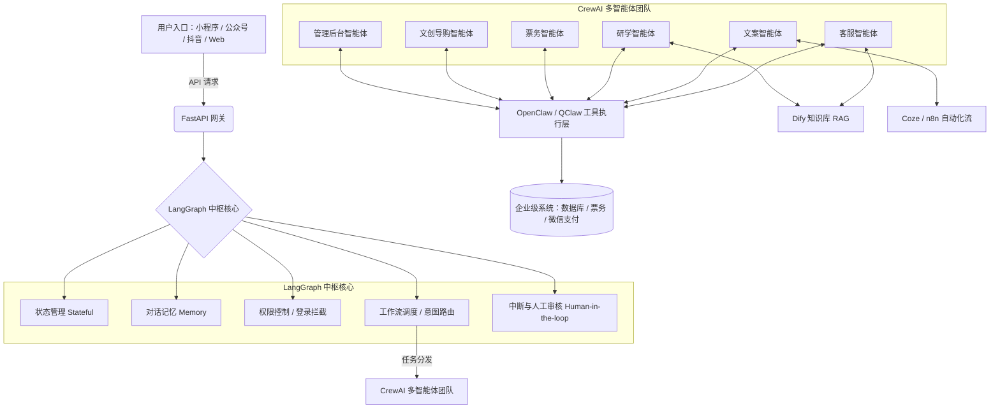

# 🏞️ 景区智能体架构图

**作者**: 麻辣虾
**日期**: 2026-03-26
**版本**: v2.0 (基于 LangGraph + CrewAI)

---

## 📐 整体架构（Mermaid）



---

## 📊 架构层次说明

### 第1层：用户接入层
```
┌───────────────┬───────────────┬───────────────┬───────────────┐
│   微信小程序   │    公众号     │    抖音       │    Web 端     │
│  (主要入口)    │  (内容传播)   │  (短视频引流) │  (深度功能)   │
└───────────────┴───────────────┴───────────────┴───────────────┘
```

### 第2层：API 网关层
```
┌─────────────────────┐
│     FastAPI 网关     │
│                     │
│ • API 请求路由      │
│ • 参数验证          │
│ • 限流控制          │
│ • 日志记录          │
│ • 错误处理          │
└─────────────────────┘
```

### 第3层：LangGraph 中枢核心
```
┌───────────────────────────────────────┐
│            LangGraph                  │
├───────────────────────────────────────┤
│  ┌─────────────┐  ┌─────────────┐    │
│  │ 状态管理    │  │  对话记忆   │    │
│  │ Stateful    │  │   Memory    │    │
│  └─────────────┘  └─────────────┘    │
│  ┌─────────────┐  ┌─────────────┐    │
│  │ 权限控制    │  │  意图路由   │    │
│  │ 登录拦截    │  │  工作流调度 │    │
│  └─────────────┘  └─────────────┘    │
│  ┌───────────────────────────────┐   │
│  │  中断与人工审核                │   │
│  │    Human-in-the-loop          │   │
│  └───────────────────────────────┘   │
└───────────────────────────────────────┘
```

### 第4层：CrewAI 多智能体团队
```
┌───────────────────────────────────────────────────────┐
│                  CrewAI 多智能体                       │
├───────────────────────────────────────────────────────┤
│  ┌───────────┐  ┌───────────┐  ┌───────────┐          │
│  │ 客服智能体 │  │ 文案智能体 │  │ 研学智能体 │          │
│  │   D1      │  │   D2      │  │   D3      │          │
│  └───────────┘  └───────────┘  └───────────┘          │
│  ┌───────────┐  ┌───────────┐  ┌───────────┐          │
│  │ 票务智能体 │  │ 文创导购  │  │ 管理后台  │          │
│  │   D4      │  │  智能体   │  │  智能体   │          │
│  │   D5      │  │   D6      │          │
│  └───────────┘  └───────────┘  └───────────┘          │
└───────────────────────────────────────────────────────┘
```

### 第5层：工具执行层
```
┌───────────────────────────────┐
│   OpenClaw / QClaw 工具       │
│                               │
│ • 系统调用                     │
│ • 文件操作                     │
│ • 第三方 API 调用              │
│ • 数据库操作                   │
└───────────────────────────────┘
```

### 第6层：知识库层
```
┌─────────────────┐  ┌─────────────────┐
│    Dify RAG     │  │   Coze / n8n    │
│    知识库       │  │    自动化流     │
├─────────────────┤  ├─────────────────┤
│ • 景点知识      │  │ • 营销自动流程  │
│ • 问答库        │  │ • 数据处理流程  │
│ • 文档管理      │  │ • 任务调度流程  │
└─────────────────┘  └─────────────────┘
```

### 第7层：企业系统层
```
┌─────────────────────────────┐
│      企业级系统              │
├─────────────────────────────┤
│  • 数据库 (PostgreSQL)      │
│  • 票务系统                  │
│  • 微信支付                  │
│  • 用户管理系统              │
│  • 日志系统                  │
└─────────────────────────────┘
```

---

## 🤖 各智能体详细说明

### 1. 客服智能体 (D1)
**功能**：
- 7x24小时在线客服
- 通用问题解答
- 意见反馈收集
- 投诉处理

**能力**：
- 对话理解与生成
- 情感分析
- 快速响应

**调用工具**：
- OpenClaw：系统调用、数据库查询
- Dify RAG：知识库检索

### 2. 文案智能体 (D2)
**功能**：
- 营销文案生成
- 社交媒体内容创作
- 活动策划文案
- 用户互动文案

**能力**：
- 创意写作
- 热点追踪
- 多风格适配

**调用工具**：
- Dify RAG：知识库（文案模板、营销知识）
- Coze：自动化流程（发布、数据分析）

### 3. 研学智能体 (D3)
**功能**：
- 研学课程推荐
- 历史文化讲解
- 互动学习助手
- 学习进度跟踪

**能力**：
- 教育知识库
- 互动式教学
- 个性化推荐

**调用工具**：
- OpenClaw：课程管理
- Dify RAG：研学知识库

### 4. 票务智能体 (D4)
**功能**：
- 门票查询与购买
- 优惠活动推送
- 订单管理
- 退改签服务

**能力**：
- 票务系统操作
- 支付集成
- 订单处理

**调用工具**：
- OpenClaw：票务系统 API

### 5. 文创导购智能体 (D5)
**功能**：
- 文创产品推荐
- 个性化搭配建议
- 购物车管理
- 订单跟踪

**能力**：
- 商品知识
- 个性化推荐
- 购物引导

**调用工具**：
- OpenClaw：电商系统 API

### 6. 管理后台智能体 (D6)
**功能**：
- 数据统计与分析
- 系统监控
- 用户行为分析
- 运营报告生成

**能力**：
- 数据分析
- 可视化展示
- 报告生成

**调用工具**：
- OpenClaw：后台系统 API

---

## 🔄 数据流程

```
用户请求
  ↓
FastAPI 网关
  ↓
LangGraph 中枢
  ├─ 状态管理 → 维护对话上下文
  ├─ 对话记忆 → 存储历史记录
  ├─ 权限控制 → 验证用户身份
  ├─ 意图路由 → 判断任务类型
  └─ 人工审核 → 特殊情况介入
  ↓
CrewAI 智能体团队
  ├─ 客服智能体 → 通用问题
  ├─ 文案智能体 → 营销内容
  ├─ 研学智能体 → 教育内容
  ├─ 票务智能体 → 门票业务
  ├─ 文创智能体 → 产品推荐
  └─ 管理智能体 → 数据分析
  ↓
┌───────────┬───────────┬───────────┐
│ OpenClaw  │ Dify RAG  │ Coze n8n  │
│ 工具执行  │ 知识库    │ 自动化    │
└───────────┴───────────┴───────────┘
  ↓
企业级系统
  ├─ 数据库
  ├─ 票务系统
  ├─ 微信支付
  └─ 用户管理
  ↓
返回结果
  ↓
推送用户
```

---

## 🛠️ 技术栈

### 前端
- **框架**: Vue.js / React
- **UI**: 微信小程序
- **实时通信**: WebSocket
- **状态管理**: Pinia / Redux

### 后端
- **框架**: FastAPI
- **AI 引擎**: LangGraph + CrewAI
- **对话管理**: LangChain
- **工作流编排**: LangGraph

### AI 能力
- **LLM**: GLM-4.7-Flash / Grok-1
- **知识库**: Dify (RAG)
- **自动化**: Coze / n8n
- **工具执行**: OpenClaw / QClaw

### 数据存储
- **数据库**: PostgreSQL
- **缓存**: Redis
- **文档**: MongoDB
- **对象存储**: OSS / S3

---

## 🚀 部署架构

```
┌─────────────────────────────────────┐
│         负载均衡 (Nginx)             │
└─────────────┬───────────────────────┘
              ↓
┌──────────────┴──────────────┐
│                             │
┌─────────────────┐    ┌─────────────────┐
│  FastAPI 服务1  │    │  FastAPI 服务2  │
│                 │    │                 │
│ • 网关路由      │    │ • 网关路由      │
│ • 业务处理      │    │ • 业务处理      │
└────────┬────────┘    └────────┬────────┘
         │                      │
         └──────────┬───────────┘
                    ↓
┌──────────────────────────────────────┐
│         LangGraph 中枢集群           │
│  ┌─────────────┬─────────────┐      │
│  │ 状态服务    │ 记忆服务    │      │
│  └─────────────┴─────────────┘      │
│  ┌──────────────────────────────┐   │
│  │    CrewAI 多智能体调度器      │   │
│  └──────────────────────────────┘   │
└──────────────────────────────────────┘
                    ↓
┌──────────────────────────────────────┐
│          工具执行层                   │
│  ┌─────┐ ┌─────┐ ┌─────┐ ┌─────┐    │
│  │Open │ │Open │ │Dify │ │Coze │    │
│  │Claw │ │Claw │ │RAG  │ │n8n  │    │
│  └─────┘ └─────┘ └─────┘ └─────┘    │
└──────────────────────────────────────┘
                    ↓
┌──────────────────────────────────────┐
│         数据存储层                    │
│  ┌─────┐ ┌─────┐ ┌─────┐ ┌─────┐    │
│  │Post  │ │Redis│ │Mongo│ │OSS  │    │
│  │greSQL│ │     │ │DB   │ │     │    │
│  └─────┘ └─────┘ └─────┘ └─────┘    │
└──────────────────────────────────────┘
```

---

## 🎯 核心优势

### ✅ 1. 统一中枢管理
- LangGraph 提供集中式的状态管理和工作流调度
- 所有智能体统一接入，易于扩展

### ✅ 2. 多智能体协作
- CrewAI 实现 6 个专业智能体并行工作
- 各司其职，提高效率

### ✅ 3. 工具化执行
- OpenClaw / QClaw 提供强大的工具执行能力
- 支持系统调用、API 调用等操作

### ✅ 4. 知识库增强
- Dify RAG 提供丰富的知识检索
- 智能体基于知识库进行回答

### ✅ 5. 自动化流程
- Coze / n8n 实现营销、数据处理等自动化
- 减少人工干预

### ✅ 6. 灵活扩展
- 易于添加新的智能体
- 支持自定义工具和知识库

---

## 📋 扩展功能规划

### 短期
- [ ] 完成智能体开发与测试
- [ ] 对接企业级系统
- [ ] 部署上线

### 中期
- [ ] 添加更多智能体（如：活动策划智能体）
- [ ] 优化智能体协作流程
- [ ] 增加数据分析和监控

### 长期
- [ ] 引入多模态 AI（语音、视频）
- [ ] 实现个性化推荐引擎
- [ ] 构建智能决策系统

---

## 🔄 下一步

- [ ] 完成智能体开发
- [ ] 集成 OpenClaw 工具
- [ ] 配置 Dify 知识库
- [ ] 测试与优化
- [ ] 部署上线

---

**作者**: 麻辣虾
**更新时间**: 2026-03-26
**版本**: v2.0
**相关**: 门神文化智能体、研学智能体、电商智能体